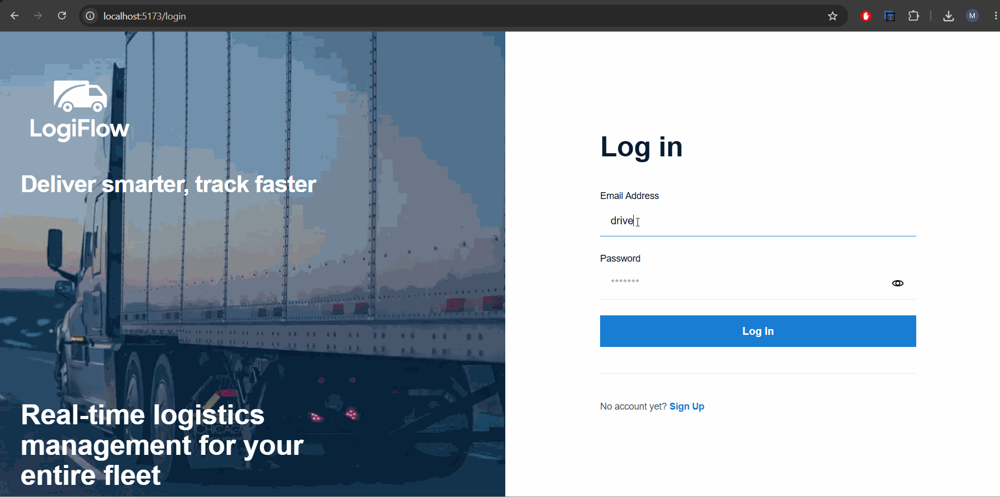
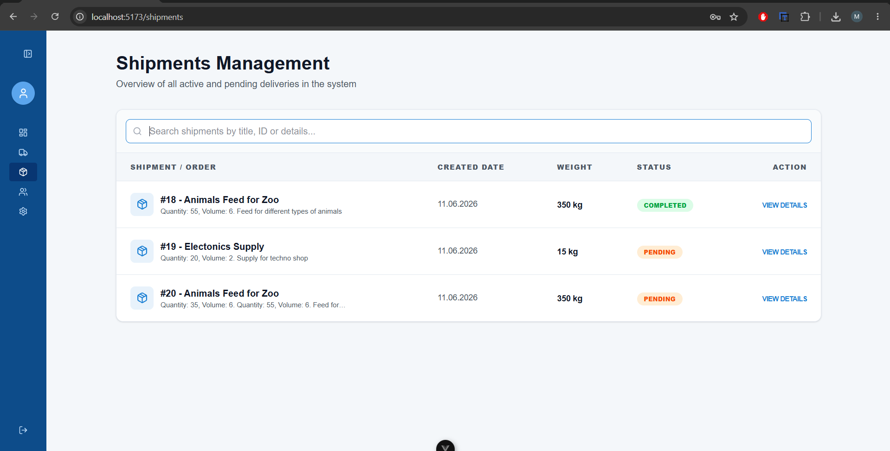
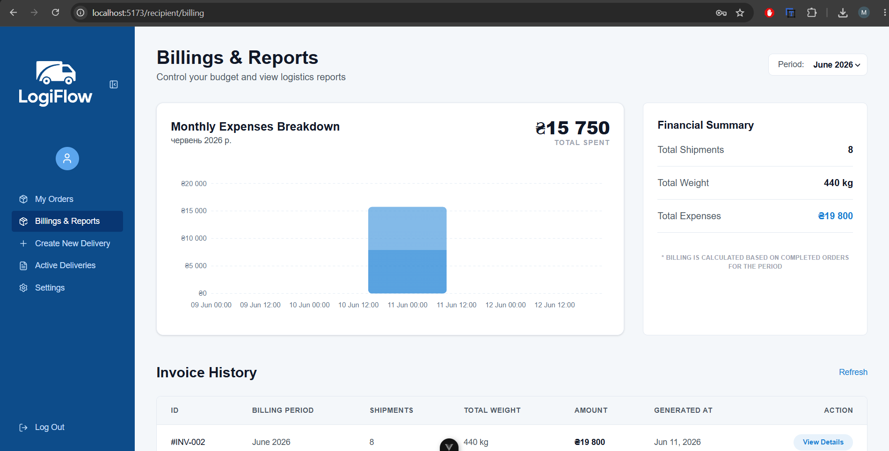
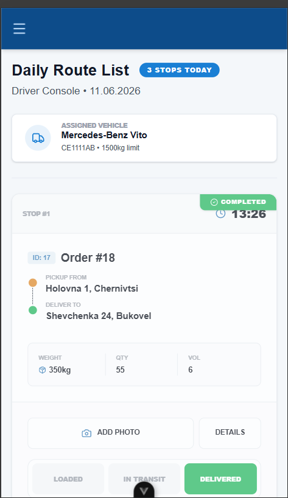
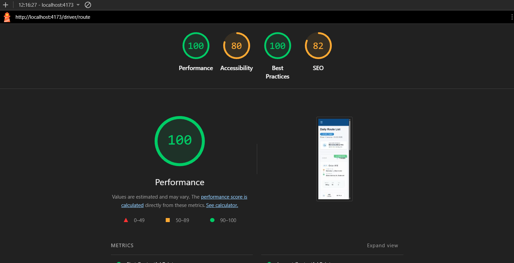

# LogiFlow — Frontend


> LogiFlow is a logistics management platform that helps teams track shipments,
> manage warehouses, and automate delivery workflows.

## Application Preview



## Features

- Shipment tracking
- Warehouse management
- Delivery workflow automation

## Role-Based Interfaces & Responsive Design

LogiFlow provides tailored, responsive experiences depending on the user's role
and device:







## Performance Optimization (Lighthouse)

Continuous UI/UX improvements and strict TypeScript checks ensure a
high-performing application:



## Tech Stack

- Vue 3 + Vite
- TypeScript
- Vue Router
- Pinia
- ESLint + Prettier + oxlint

### State Management

The application uses **Pinia** as the Single Source of Truth:

- `authStore`: Manages the user session lifecycle, JWT tokens, and driver
  profile (including assigned vehicles).
- `routesStore`: Synchronizes logistics routes between the client and server
  using Optimistic UI updates.
- `notificationStore`: Global manager for toast notifications.

All stores are strictly typed using TypeScript (`Route`, `Order`, `Vehicle`).

## Getting Started

### Prerequisites

- Node.js >= 20

### Installation

```bash
git clone [https://github.com/practice-team-lymhqo34/frontend.git](https://github.com/practice-team-lymhqo34/frontend.git)
cd frontend
npm install
```

### Running

```bash
npm run dev
```

### Build for production

```bash
npm run build
npm run preview
```
